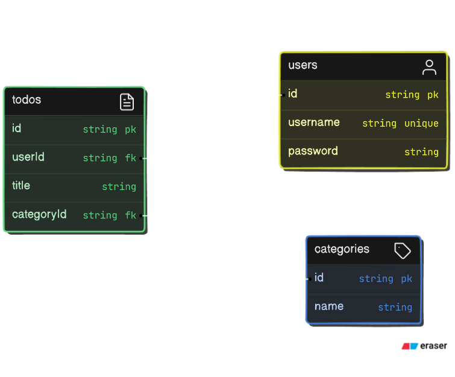

# ERD

# API Endpoints

| Method | Endpoint       | Description                             |
| ------ | -------------- | --------------------------------------- |
| POST   | /user/register | Register a new user                     |
| POST   | /user/login    | Login a user and set user ID in cookies |
| POST   | /todo          | Create a new todo                       |
| GET    | /todo          | Get all todos                           |
| GET    | /todo/:id      | Get a specific todo by ID               |
| PUT    | /todo/:id      | Update a specific todo by ID            |
| DELETE | /todo/:id      | Delete a specific todo by ID            |
| POST   | /category      | Create a new category                   |
| GET    | /category      | Get all categories                      |
| GET    | /category/:id  | Get a specific category by ID           |
| PUT    | /category/:id  | Update a specific category by ID        |
| DELETE | /category/:id  | Delete a specific category by ID        |

# Flowchart

## /register

## /login

## /todo POST

